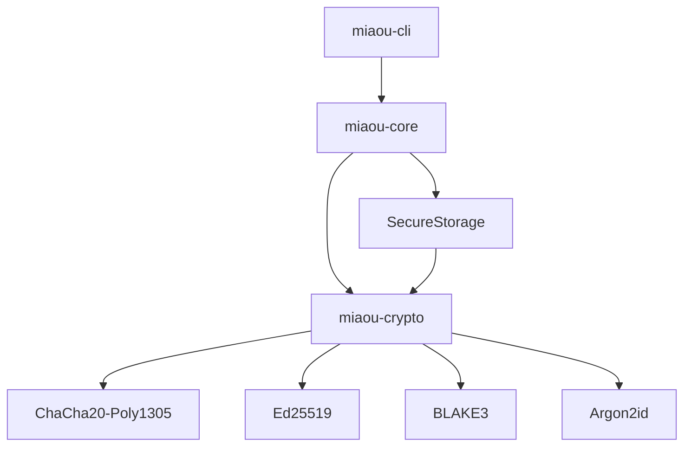

# ARCHITECTURE MIAOU v0.1.0

## Vue d'ensemble

Miaou v0.1.0 "Première Griffe" implémente une **architecture modulaire** basée sur un workspace Rust avec séparation claire des responsabilités.

## Structure du projet

```
miaou/
├── miaou-crypto/          # Primitives cryptographiques
├── miaou-core/            # Logique métier centrale  
├── miaou-cli/             # Interface en ligne de commande
├── docs/                  # Documentation complète
├── scripts/               # Outils et automatisation
├── tests/                 # Tests d'intégration
└── benches/               # Benchmarks de performance
```

## Crates modulaires

### 🔐 **miaou-crypto**
**Responsabilités :**
- Primitives cryptographiques sécurisées
- Chiffrement ChaCha20-Poly1305 avec AAD obligatoire
- Signatures Ed25519 avec zeroization
- Hachage BLAKE3 et dérivation Argon2id
- Traits object-safe pour polymorphisme

**Tests :** 34 tests unitaires - 100% de réussite

### 🧠 **miaou-core** 
**Responsabilités :**
- Gestion des profils utilisateur sécurisés
- Stockage chiffré avec authentification
- Abstractions communes multi-plateforme
- Re-exports des primitives crypto

**Tests :** 6 tests d'intégration - 100% de réussite

### 🖥️ **miaou-cli**
**Responsabilités :**
- Interface utilisateur interactive
- Commandes de gestion des profils
- Tests et benchmarks intégrés
- Mode interactif avec aide contextuelle

**Tests :** Interface validée manuellement

## Principes architecturaux

### Séparation des préoccupations
- **Crypto** : Primitives pures sans dépendances métier
- **Core** : Logique métier réutilisable
- **CLI** : Interface utilisateur spécialisée

### Sécurité by design
- Zeroization automatique des secrets
- AAD obligatoire pour AEAD
- Traits object-safe uniquement
- Validation stricte des entrées

### Modularité
- Crates indépendants et testables
- Re-exports cohérents
- Workspace unifié avec dépendances partagées

## Flux de données



## Performances

| Primitive | Performance | Note |
|-----------|-------------|------|
| BLAKE3 | ~2000 MiB/s | Hachage 1MB |
| Ed25519 | ~8000 sig/s | Signatures |
| ChaCha20-Poly1305 | ~3000 ops/s | Chiffrement 1KB |
| Argon2id | Configurable | Dérivation de clés |

## Évolution future

### Phase 2 (v0.2.0)
- Ajout du réseau P2P
- Communication TLS 1.3
- Découverte de pairs

### Architecture cible
```
miaou-crypto/     # Primitives (stable)
miaou-core/       # Logique métier étendue
miaou-network/    # Nouveau : P2P et réseau
miaou-protocol/   # Nouveau : Protocoles Miaou
miaou-cli/        # Interface étendue
miaou-gui/        # Futur : Interface graphique
```

## Décisions techniques

### Rust comme langage principal
- Sécurité mémoire sans GC
- Performance native
- Écosystème crypto mature
- Support multi-plateforme

### Stack cryptographique
- **Option A** retenue : RustCrypto + Dalek
- Évite le mixing de bibliothèques incompatibles
- Cohérence et auditabilité
- APIs stables et documentées

### Architecture workspace
- Séparation claire des responsabilités
- Tests indépendants par crate
- Réutilisabilité maximale
- Évolutivité facilitée

Cette architecture constitue une base solide pour l'évolution future de Miaou vers une plateforme de communication décentralisée complète.